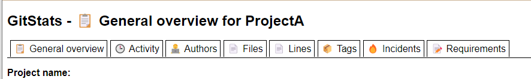

# gitstats
git history statistics generator + few enhancements

## This fork add 2 main things.
1. Scanning for INCIDENTS tickets patterns.
1. Scanning for REQUIREMENTS / TASKS tickets patterns.

Also externalize titles names.

## Preview

